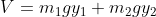

### Theory

The double pendulum is a classic example in physics that involves the study of a system consisting of two interconnected pendulums. It is a simple yet chaotic system that demonstrates sensitive dependence on initial conditions and exhibits complex, non-linear behavior.

A double pendulum consists of two pendulums connected to each other. The first pendulum (called the "upper" or "inner" pendulum) is attached to a fixed point, and the second pendulum (called the "lower" or "outer" pendulum) is connected to the end of the first pendulum. The motion of the double pendulum is more complex and exhibits chaotic behavior.

The double pendulum system behaves like a linear system for small angles, generating a Lissajous curve trajectory. The pendulum is non-linear for large angles, and the phase graph becomes more complex.

The behavior of the double pendulum is governed by a set of coupled, non-linear differential equations known as the Lagrangian equations. These equations describe the conservation of energy and angular momentum in the system. Solving these equations analytically is extremely challenging due to their non-linear nature. Therefore, numerical methods or computer simulations are typically used to study the behavior of the double pendulum.

We regard the pendulum rods as being massless and rigid. We regard the pendulum masses as being point masses.

The equation of motion of a double pendulum can be obtained using the Lagrangian method.

Fig. 1.

[Double pendulum](https://scienceworld.wolfram.com/physics/dimg270.gif)

Consider a double bob pendulum with masses m1 and m2 attached by rigid massless wires of lengths l1 and l2. Further, let the angles the two wires make with the vertical be denoted as 𝜭1 and 𝜭2, as illustrated above. Finally, let gravity be given by g. Then the positions of the bobs are given by

 - - - - - - - - - -(1)

 - - - - - - - - - -(2)

 - - - - - - - - - -(3)

 - - - - - - - - - -(4)

Then the potential energy of the system is,

 - - - - - - - - - -(5)

 - - - - - - - - - -(6)

And the kinetic energy is,

 - - - - - - - - - -(7)

 - - - - - - - - - -(8)

The Lagrangian is then,

 - - - - - - - - - -(9)

 - - - - - - - - - -(10)

So, the equation of motion for 𝜭1 and 𝜭2 are,

 - - - - - - - - - -(11)

 - - - - - - - - - -(12)

The above equations (11) and (12) are close to the form needed to obtain a numerical solution using the Runge Kutta method. These equations are the equations of motion for the double pendulum. The equations of motion describe how gravitational, inertial, and tension forces interact to produce the complex motion of the inner and outer pendulums. These equations reveal the exchange of energy and momentum between the two pendulums, explaining their chaotic behavior and sensitivity to initial conditions.

